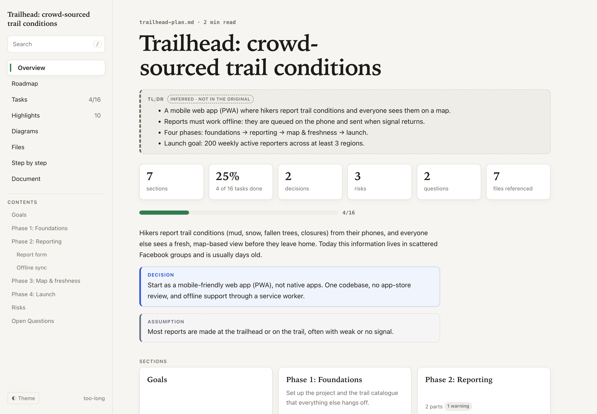
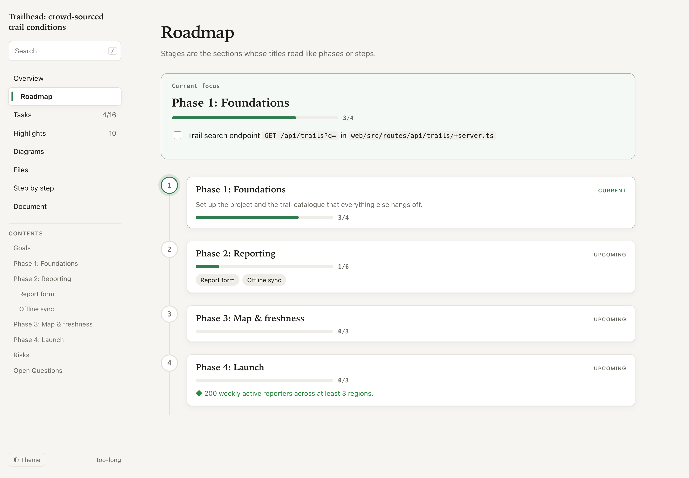
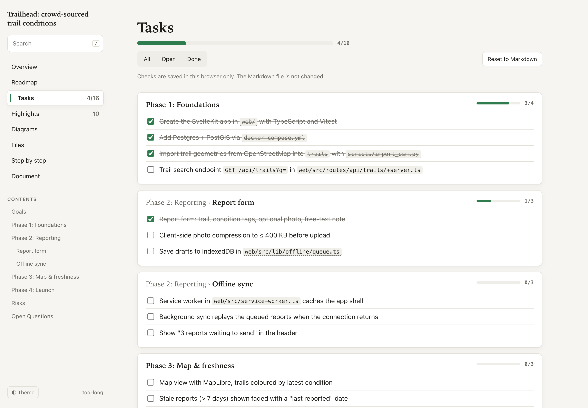
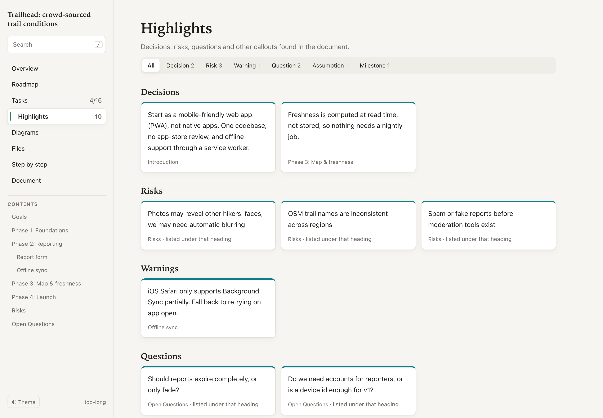
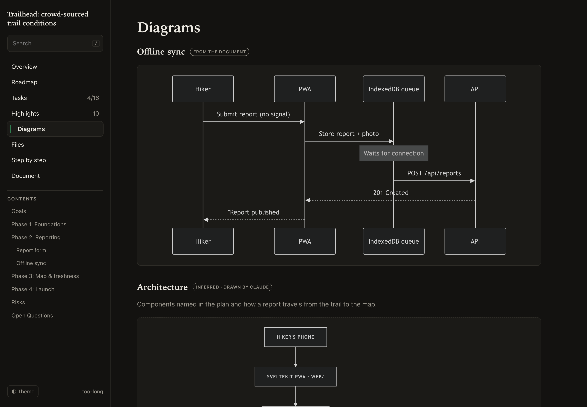
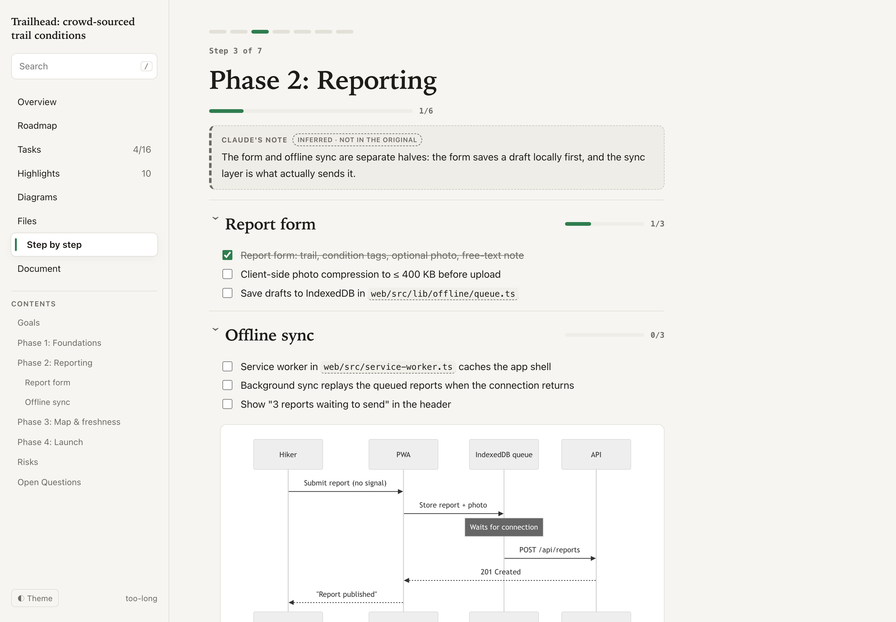
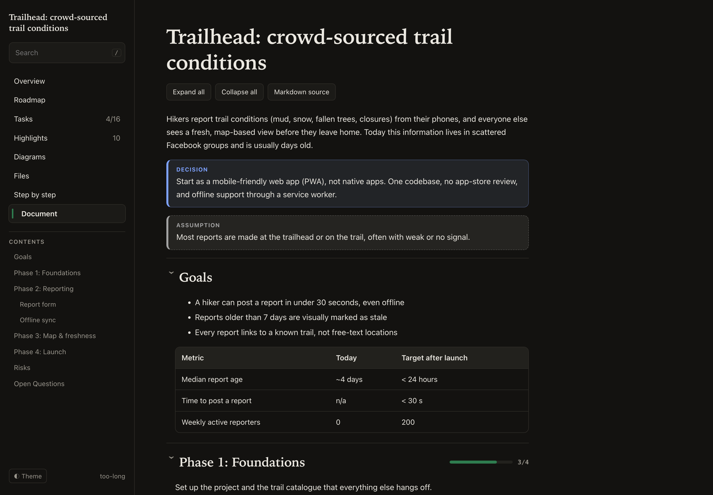

# too-long

**Too long. Just show me.**

A [Claude Code](https://claude.com/claude-code) skill that turns a long Markdown plan or technical document into a polished, interactive local website, built for what *you* want from it: a roadmap, a progress tracker, an architecture view, a step-by-step walkthrough, or simply something easier to read.

No npm, no build step, no server. The output is a static folder you open by double-clicking `index.html`.



## Installation

You need [Claude Code](https://claude.com/claude-code) and Python 3.8+ (standard library only).

### One prompt

Paste this into Claude Code:

```text
Install the too-long skill from https://github.com/GalHavshush/too-long: clone it into ~/.claude/skills/too-long (create ~/.claude/skills if it doesn't exist; if too-long is already there, run git pull in it instead). Then check that ~/.claude/skills/too-long/SKILL.md exists and tell me how to use it.
```

### Manually

For every project (personal skill):

```bash
git clone https://github.com/GalHavshush/too-long ~/.claude/skills/too-long
```

For one project only (commit it so your team gets it too):

```bash
git clone https://github.com/GalHavshush/too-long .claude/skills/too-long
```

Start a new Claude Code session afterwards so the skill is picked up. To update:

```bash
git -C ~/.claude/skills/too-long pull
```

## Usage

Ask Claude Code in plain words and name the file:

```text
Use too-long on plan.md
too-long this plan
Make docs/spec.md easier to understand with too-long
Use too-long to turn this into a visual roadmap
```

Claude reads the whole document, then asks what you want the visual version to help you do (unless you already said), for example:

- make it easier to read and navigate
- show it as a roadmap or timeline
- visualize architecture and relationships
- turn it into an implementation dashboard and track progress
- learn it step by step
- present it

You can pick several. Claude proposes which views fit *this* document, builds the site into `.too-long/`, and opens it.

You can also run the scripts yourself:

```bash
python3 ~/.claude/skills/too-long/scripts/parse.py plan.md   # structure summary
python3 ~/.claude/skills/too-long/scripts/build.py plan.md   # build .too-long/
open .too-long/index.html
```

## Example

[`examples/trailhead-plan.md`](examples/trailhead-plan.md) is a made-up plan for a trail-conditions app: four phases with checkboxes, decisions, risks, open questions, a table, a Mermaid diagram and file paths. The prompt was:

```text
Use too-long on examples/trailhead-plan.md. I want to track implementation, see the architecture, and be able to walk a new teammate through it.
```

The generated site is committed in [`examples/trailhead-site/`](examples/trailhead-site/). Clone the repo and open `examples/trailhead-site/index.html` to click around. Its [`config.json`](examples/trailhead-site/config.json) shows what Claude chose.

**Roadmap:** phases detected from the headings, with progress and a "current focus" card listing the next open tasks.



**Tasks:** every checkbox, grouped by section, with filters. Checks are saved in your browser; the Markdown is never changed.



**Highlights:** decisions, risks, warnings, assumptions, questions and milestones pulled out as cards, each linking back to where it appears.



**Diagrams:** Mermaid diagrams from the document, plus diagrams Claude drew from the text, clearly labelled as inferred.



**Step by step:** one section per screen, arrow-key navigation, and "mark as understood".



**Document:** the full document with collapsible sections, a scroll-synced table of contents, search, and a raw Markdown toggle.



## Views

Only the views that fit the document and your goal are generated.

| View | What it shows |
|---|---|
| Overview | Title, TL;DR, stats, intro, section cards with progress |
| Document | The whole document. Always included |
| Roadmap | Stages as a timeline with status and current focus |
| Tasks | All checkboxes (or numbered steps you choose to track), with progress |
| Highlights | Decisions, risks, warnings, questions, assumptions, milestones |
| Diagrams | Mermaid from the document + inferred diagrams |
| Files | Tree of every file path the document mentions |
| Step by step | One section at a time, for learning or presenting |

Every site has search, light/dark mode, and works on phones.

## Faithful to the source

The Markdown is the source of truth. too-long never removes content (the Document view always shows everything) and never invents requirements, tasks, decisions or dependencies. Anything Claude adds, like a TL;DR, a section note or an architecture diagram, is labelled **"Inferred · not in the original"**.

## How it works

```
plan.md ──parse.py──▶ content model ──(Claude: pick views, write config.json)──▶ build.py ──▶ .too-long/
                                                                                              index.html
                                                                                              styles.css
                                                                                              app.js
                                                                                              data.js
```

1. **`scripts/parse.py`** turns Markdown into a JSON content model: sections, blocks, and indexes of tasks, callouts, diagrams and file paths. It recognizes `- [ ]` tasks, `Decision:` / `Risk:` / `Question:` style callouts, GitHub `> [!WARNING]` alerts, headings like "Risks" or "Open Questions", phase-like titles, Mermaid blocks and file paths.
2. **Claude** picks the views for your goal and writes `config.json`. That file holds the view list, accent color, TL;DR, notes, extra diagrams, roadmap stages and which numbered steps to track.
3. **`scripts/build.py`** validates the config, copies the template from `assets/`, and writes `data.js`. `assets/app.js` (vanilla JS) renders the views from that data.

[`SKILL.md`](SKILL.md) holds the instructions Claude follows, including the config reference.

```
too-long/
├── SKILL.md            # what Claude follows
├── scripts/
│   ├── parse.py        # Markdown → content model
│   ├── build.py        # content model + config → site
│   └── test_parse.py   # parser test: python3 scripts/test_parse.py
├── assets/             # site template (HTML, CSS, vanilla JS)
├── examples/           # example plan + generated site
└── docs/screenshots/
```

## Limits

- Mermaid diagrams load mermaid.js from a CDN the first time. Offline, the diagram source is shown instead.
- Task checks are stored in the browser (localStorage) and are not written back to the Markdown.
- Raw HTML inside the Markdown is shown as text.

## License

[MIT](LICENSE)
