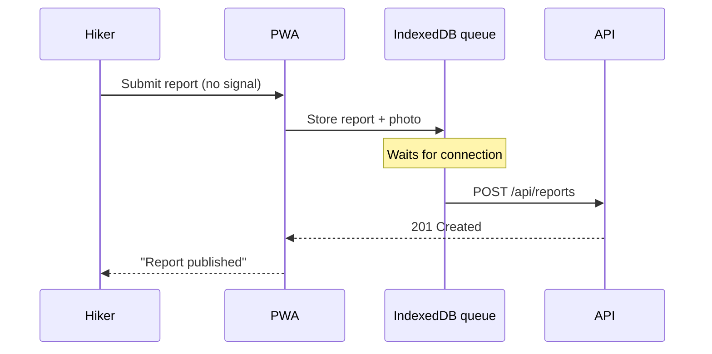

# Trailhead: crowd-sourced trail conditions

Hikers report trail conditions (mud, snow, fallen trees, closures) from their phones, and everyone else sees a fresh, map-based view before they leave home. Today this information lives in scattered Facebook groups and is usually days old.

**Decision:** Start as a mobile-friendly web app (PWA), not native apps. One codebase, no app-store review, and offline support through a service worker.

Assumption: Most reports are made at the trailhead or on the trail, often with weak or no signal.

## Goals

- A hiker can post a report in under 30 seconds, even offline
- Reports older than 7 days are visually marked as stale
- Every report links to a known trail, not free-text locations

| Metric | Today | Target after launch |
|---|---|---|
| Median report age | ~4 days | < 24 hours |
| Time to post a report | n/a | < 30 s |
| Weekly active reporters | 0 | 200 |

## Phase 1: Foundations

Set up the project and the trail catalogue that everything else hangs off.

- [x] Create the SvelteKit app in `web/` with TypeScript and Vitest
- [x] Add Postgres + PostGIS via `docker-compose.yml`
- [x] Import trail geometries from OpenStreetMap into `trails` with `scripts/import_osm.py`
- [ ] Trail search endpoint `GET /api/trails?q=` in `web/src/routes/api/trails/+server.ts`

```sql
CREATE TABLE trails (
  id          BIGINT PRIMARY KEY,      -- OSM relation id
  name        TEXT NOT NULL,
  region      TEXT NOT NULL,
  geometry    GEOGRAPHY(MULTILINESTRING) NOT NULL
);
```

## Phase 2: Reporting

### Report form

- [x] Report form: trail, condition tags, optional photo, free-text note
- [ ] Client-side photo compression to ≤ 400 KB before upload
- [ ] Save drafts to IndexedDB in `web/src/lib/offline/queue.ts`

### Offline sync

- [ ] Service worker in `web/src/service-worker.ts` caches the app shell
- [ ] Background sync replays the queued reports when the connection returns
- [ ] Show "3 reports waiting to send" in the header



> [!WARNING]
> iOS Safari only supports Background Sync partially. Fall back to retrying on app open.

## Phase 3: Map & freshness

- [ ] Map view with MapLibre, trails coloured by latest condition
- [ ] Stale reports (> 7 days) shown faded with a "last reported" date
- [ ] Trail page lists the last 20 reports, newest first

**Decision:** Freshness is computed at read time, not stored, so nothing needs a nightly job.

## Phase 4: Launch

- [ ] Moderation: hide a report after 3 independent flags
- [ ] Seed 3 regional hiking groups as beta reporters
- [ ] Public launch post

Milestone: 200 weekly active reporters across at least 3 regions.

## Risks

- Photos may reveal other hikers' faces; we may need automatic blurring
- OSM trail names are inconsistent across regions
- Spam or fake reports before moderation tools exist

## Open Questions

- Should reports expire completely, or only fade?
- Do we need accounts for reporters, or is a device id enough for v1?
